# drain



**Battery-drain triage TUI. Catches the polling loop you didn't mean to write.**

    

Small TUI that answers one question fast: **what is draining my
battery right now, and did I just make it worse?**

`top` and `htop` show CPU%. `powertop` is the kernel-level truth but
needs a tracing kernel, takes seconds to settle, and floods the
screen with what you didn't ask. `drain` reads `/proc` directly,
samples once per second, and ranks processes by a single drain score
combining **CPU%**, **voluntary context switches/s** (the polling
proxy), and **I/O bytes/s**.

It also pairs with [glass](https://github.com/isene/glass) and
[tile](https://github.com/isene/tile) (the CHasm asm WM/terminal):
the **WS** column attributes each process to its workspace via
`_NET_WM_PID` + `_NET_WM_DESKTOP`, so you can tell *which* glass is
the rogue one when you have several. A pinned **suite** summary line
shows aggregate wakes/s for `glass` / `tile` / `strip` / `bare` /
asmites at a glance.

Part of the [Fe₂O₃](https://github.com/isene/fe2o3) Rust terminal
suite.

## Why ctx-switches/s?

A polling loop wakes the CPU once per timer tick. Each wake counts
as one voluntary context switch in `/proc/<pid>/status`. So
`Δvoluntary_ctxt_switches / Δt` is the wakes-per-second rate — the
single best signal for "I introduced a poll where I should have used
an event wait". Watching CPU% alone misses the worst kind of waste:
the tight 10ms timer that uses 0.1% CPU but kills your battery from
the wakeups it causes the whole CPU package to do.

## Features

- **Per-process top-N** — CPU%, wakes/s, NVOL/s (preempted/s), I/O,
  and a five-dot weighted drain score
- **Battery W in header** — current draw, Δ vs rolling 30-sample
  average, Δ vs persistent baseline, hours-remaining estimate
- **WS column** — workspace attribution via EWMH `_NET_WM_PID` +
  `_NET_WM_DESKTOP`. Falls back to `QueryTree` on minimal WMs
- **Pinned suite summary** — `glass×3 21.5w/s · tile 4.8w/s · …`
  always-visible "is the asm suite behaving?"
- **Diff mode** (`d`) — highlights processes whose wakes/s rate is
  significantly above their own historical baseline. Catches "did
  this code change introduce polling?" without you remembering the
  old number
- **Persistent baseline** — auto-saved to `~/.cache/drain/state.json`
  on quit, reloaded on start. Carries across sessions
- **Thread expansion** (`Enter`) — drill into `/proc/<pid>/task/`
  for a multi-threaded process. Catches the case where one Firefox
  thread is the offender, not the whole browser
- **`strace -c` integration** (`S`) — attach to selected pid for 3s,
  show syscall histogram in the analysis pane. Answers "what is it
  actually doing?" without leaving drain
- **claude analysis pane** — `claude -p` runs at startup and on `c`
  with the top drainers as prompt; suggests likely polling-loop
  candidates. `Ctrl+Y` copies the analysis to your clipboard via
  OSC 52 (no `xclip` fork)
- **Filter** (`/`) — substring match on process name. Useful when
  you want to track one process across config changes
- **Configurable refresh interval** (`+`/`-`) — 0.5s to 10s
- **Pause** (`p` or `f`) — freeze sampling so you can read the table

## Install

```bash
cargo build --release
ln -sf $(pwd)/target/release/drain ~/bin/drain
```

Static-linked dependencies: `crust` (TUI), `x11rb` (X11 wire
protocol for the WS column), `libc` (sysconf). No tracing kernel,
no root.

`strace -c` requires ptrace permission. If `kernel.yama.ptrace_scope = 1`
(the typical default), you can either run drain with `sudo` for
strace mode, or set `kernel.yama.ptrace_scope = 0` for your session.

## Key bindings

| Key | Action |
|-----|--------|
| `q` | quit (saves baseline) |
| `↑` / `↓` | move row selection |
| `Enter` | expand selected pid into per-thread view |
| `S` | attach `strace -c` to selected pid for 3s |
| `Esc` | close threads / strace overlay |
| `s` | cycle sort: drain → cpu → wakes → io → drain |
| `d` | toggle diff mode (highlight anomalies vs baseline) |
| `/` | enter filter; type substring; `Enter` apply, `Esc` cancel |
| `+` / `-` | refresh interval ±0.5s (range 0.5s … 10s) |
| `p` / `f` | pause / unpause sampling |
| `c` | re-query claude analysis |
| `Ctrl+Y` | copy claude analysis to clipboard (OSC 52) |
| `r` | reset rolling-average bat watt readout |
| `h` / `?` | toggle help line in footer |

## Workflow when battery W jumps from 4 → 7+

1. Open `drain`. Header shows current Bat W with Δ vs the rolling
   average and Δ vs your persistent baseline.
2. Press `s` to cycle to **wakes** sort. The top of the list is the
   suspect.
3. If you suspect a recent change in your own code, press `d` to
   enable diff mode. Rows that have spiked above their historical
   baseline get an `↑↑↑` / `↑↑` / `↑` badge.
4. Press `↑/↓` to highlight the row. `Enter` expands threads;
   `S` attaches strace and shows the syscall breakdown in the
   analysis pane on the right.
5. The WS column tells you which glass / firefox / slack / etc.
   instance it is when you have several.
6. The pinned **suite** line at the top shows aggregate wakes/s
   for the asm tools — instant "is the foundation still cold?"
   check.

## Layout

```
 drain  Bat 4.21 W ↓  (Δ -0.13 W vs 30-sample avg)   |   baseline -0.40 W   8.4h left   sort: drain
   suite:   glass×3 21.5w/s   tile 4.8w/s   strip 2.4w/s   bare 0.0w/s
       PID  PROC                  WS   CPU%    WAKE/s    NVOL/s   IO kB/s   DRAIN
   1208672  firefox                7    3.1     180.5       4.2       3.1   ●●●●●
    856756  Xorg                   ·    0.2      83.0       0.0       0.0   ●●○○○
   1175734  glass                  3    0.1      21.0       0.0       0.0   ●●○○○
   ...                                                                              ─── analysis ───
                                                                                    
                                                                                    Firefox at 180 wakes/s on
                                                                                    WS 7 dominates here. Likely
                                                                                    background-tab JS animation
                                                                                    or video. Try freezing the
                                                                                    tab or enabling Memory Saver.
                                                                                    Xorg at 83 wakes/s tracks
                                                                                    Firefox repaints — normal.
                                                                                    The asm tools are quiet; the
                                                                                    suite is behaving.
                                                                                    
 q · ↑↓ · Enter · S · s · d · / · +/- · p · c · C-y · r · h help                                drain v0.1.3
```

## Drain score

A weighted sum, tuned for a 4 W idle laptop:

```
drain = cpu_pct + wakes_per_s × 0.05 + (io_bytes/1024) × 0.02
```

Five dots map roughly to:

| Dots | Drain | Typical cause |
|---|---|---|
| `●●●●●` | ≥ 50 | Tight CPU loop or 1000+ wakes/s |
| `●●●●○` | ≥ 20 | Heavy work; one busy app |
| `●●●○○` | ≥ 8 | Background polling that adds up |
| `●●○○○` | ≥ 3 | Active but reasonable |
| `●○○○○` | ≥ 1 | Almost-quiet |
| `○○○○○` | < 1 | Idle |

Rationale: a tight 10% CPU loop is worse than 200 wakes/s of an
otherwise-sleeping process, but 200 wakes/s of context-switch
overhead is worse than 4% CPU of useful steady work. The 0.05
weight on wakes hits both with the right severity.

## Limitations

- `/proc/<pid>/io` is restricted on Linux — non-owned PIDs report 0
  for I/O without `CAP_SYS_PTRACE`. Fine for your own user-session
  drain hunting; matters if you want to chase a daemon.
- `_NET_WM_PID` is set by most apps but not all (some Java Swing
  apps, some headless tools). Those show `·` in the WS column.
  `?` means the window has a `_NET_WM_PID` but no `_NET_WM_DESKTOP`
  — common on minimal WMs that don't publish per-window desktop info.
- `strace -c` needs ptrace permission. See Install notes above.
- claude pane needs the [`claude` CLI](https://docs.claude.com/claude-code/)
  in `$PATH`. Without it, `c` and the initial query show an error
  in the analysis pane; everything else still works.
- Sub-second polling loops between samples are still visible (they
  show up as elevated wakes/s) but `drain` itself only refreshes
  once per second to keep its own footprint negligible. `drain`
  appears in its own table — pressing `+` to slow the refresh
  drops drain's own footprint visibly.

## Files

```
~/.cache/drain/state.json   persistent baseline (bat W avg + per-comm wakes/cpu medians)
```

## Related

- [glass](https://github.com/isene/glass) — terminal where drain runs
- [tile](https://github.com/isene/tile) — WM that publishes the
  `_NET_WM_DESKTOP` drain reads
- [strip](https://github.com/isene/tile) — status bar segment
  helpers; one of drain's first targets when you suspect "did my
  asmite refactor regress?"
- [Fe₂O₃ landing page](https://isene.github.io/fe2o3/) — the family
